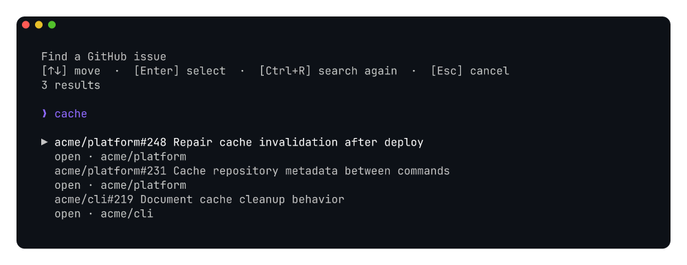
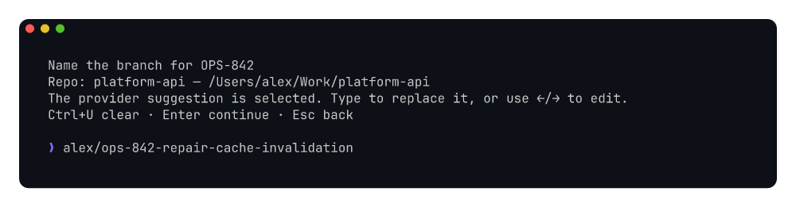
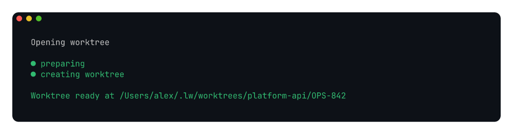

# lw

`lw` turns a Linear, GitHub, Jira, or custom-provider issue into an isolated Git worktree. It can
print the path or launch your coding tool directly inside it:

```sh
cd "$(lw)"
lw run -- claude
```

It is a local, read-only client for issue providers. It only starts a tool when you explicitly use
`lw run`.

## Screenshots

### Search issues



### Name the branch



### Create the worktree



The screenshots use synthetic data rendered from the real TUI views. See
[`docs/images`](docs/images/README.md) to regenerate them.

## Features

- Launches coding tools directly inside a selected issue's worktree with `lw run`.
- Searches Linear, GitHub Issues, and Jira Cloud.
- Routes each provider scope to the right local repository.
- Reuses matching local or remote branches before creating one.
- Supports repository-specific branch templates.
- Stores issue metadata locally for `lw context` and coding-agent integrations.
- Prints only the worktree path on stdout, so command substitution stays safe.
- Prunes merged or gone worktrees without force-removing dirty checkouts.
- Keeps provider access read-only and sends no telemetry.

Worktrees use a predictable path independent of the branch name:

```text
~/.lw/worktrees/<repository>/<ISSUE>
```

## Run tools in the issue worktree

`lw run` creates or reuses the selected issue's worktree, then starts a command inside it:

```sh
lw run -- claude
lw run -- codex --full-auto
lw run -- cursor .
```

The command runs directly, without a shell, and owns the terminal and exit code. Issue metadata is
available through `lw context`; it is not automatically injected into the command. Provider API
tokens are removed from the command's environment.

## Install

Install the latest release on macOS or Linux:

```sh
curl -fsSL https://raw.githubusercontent.com/Snaylaker/lw/main/install.sh | sh
```

The installer supports Intel and Apple Silicon macOS, plus AMD64 and ARM64 Linux. It verifies
release checksums and installs to `~/.local/bin/lw` without `sudo`.

Build from source with Go 1.26 or newer:

```sh
git clone https://github.com/Snaylaker/lw
cd lw
go build -o ~/.local/bin/lw ./cmd/lw
```

## Use

Run `lw` inside a repository for interactive search, or provide an issue directly:

```sh
cd "$(lw)"
cd "$(lw --issue ENG-3971 --branch alex/eng-3971-fix)"
cd "$(lw --issue ENG-3971 --repo ~/Work/api --branch alex/eng-3971-fix)"
```

Direct mode needs `--branch` before creating a branch unless the repository has a branch rule.
Existing local or remote issue branches always take precedence.

### Choose a provider

Linear is the default. Select another provider with `--provider`, a reference prefix,
`LW_ISSUE_PROVIDER`, or `issueProvider` in `config.json`.

| Provider | Direct reference | Authentication |
| --- | --- | --- |
| Linear | `ENG-3971` or `linear:ENG-3971` | onboarding, `LINEAR_API_KEY`, or `credentialCommand` |
| GitHub | `github:owner/repository#42` | `GITHUB_TOKEN`, `GH_TOKEN`, or public access |
| Jira Cloud | `jira:OPS-42` | `JIRA_BASE_URL`, `JIRA_EMAIL`, and `JIRA_API_TOKEN` |

```sh
lw --provider github
lw --issue 'github:owner/repository#42' --branch alex/gh-42-fix
lw --provider jira --issue OPS-42 --branch alex/ops-42-fix
```

Linear onboarding stores its key in the system credential manager when available. GitHub, Jira,
and custom-provider credentials remain environment-owned. Provider tokens declared through the
provider contract are removed from Git children and commands launched through `lw run`.

### Configure branch names

When no issue branch exists, the interactive flow offers an editable provider suggestion or
fallback. Save a repository convention without editing JSON:

```sh
lw branches set-rule --username alex '{username}/{ticket}/{slug}'
lw branches show-rule
lw branches preview ENG-3971
lw branches unset-rule
```

Templates support `{username}`, `{ticket}`, `{ticket_lower}`, `{slug}`, `{suggested_branch}`, and
`{linear_branch}`. They are expanded as data and never executed.

## Commands

| Command | Purpose |
| --- | --- |
| `lw` | select an issue and create or reuse its worktree |
| `lw --issue <ref> --branch <name>` | skip the picker |
| `lw --provider <name>` | select an issue provider |
| `lw doctor` | inspect provider, Git, and local configuration |
| `lw branches <command>` | manage repository branch rules |
| `lw context [--json]` | print local issue context |
| `lw summary <text>` | update the local worktree summary |
| `lw run -- <command>` | run a command inside the selected issue's worktree |
| `lw prune [--yes]` | inspect or remove stale worktrees |
| `lw logout` | remove the Linear key saved by onboarding |

Successful worktree creation prints exactly one path to stdout. UI, progress, warnings, and errors
use stderr.

## Custom providers

The public [`provider`](provider/provider.go) package defines a read-only provider contract. Custom
providers are compiled into a custom binary through `lw.Run`; the official binary includes Linear,
GitHub, and Jira. This is not a runtime plugin protocol.

## Local data and privacy

Configuration lives under `$LW_CONFIG_DIR`, `$XDG_CONFIG_HOME/lw`, or the platform config
directory. Worktree metadata is stored as `lw.json` in the worktree's private Git directory, not in
the checkout.

`lw` has no hosted service or telemetry. Network requests go only to the selected issue provider,
the repository's `origin` during branch resolution, and GitHub during installation. It never writes
to an issue provider.

## Documentation

- [Behavioral specification](SPEC.md)
- [Architecture](ARCHITECTURE.md)
- [Agent integrations](docs/agent-integrations.md)
- [Contributing](CONTRIBUTING.md)
- [Security](SECURITY.md)
- [Release process](docs/RELEASING.md)

`lw` is independent and is not affiliated with or endorsed by Linear, GitHub, or Atlassian.

## License

[MIT](LICENSE). Dependency licenses are listed in
[THIRD_PARTY_NOTICES.md](THIRD_PARTY_NOTICES.md).
